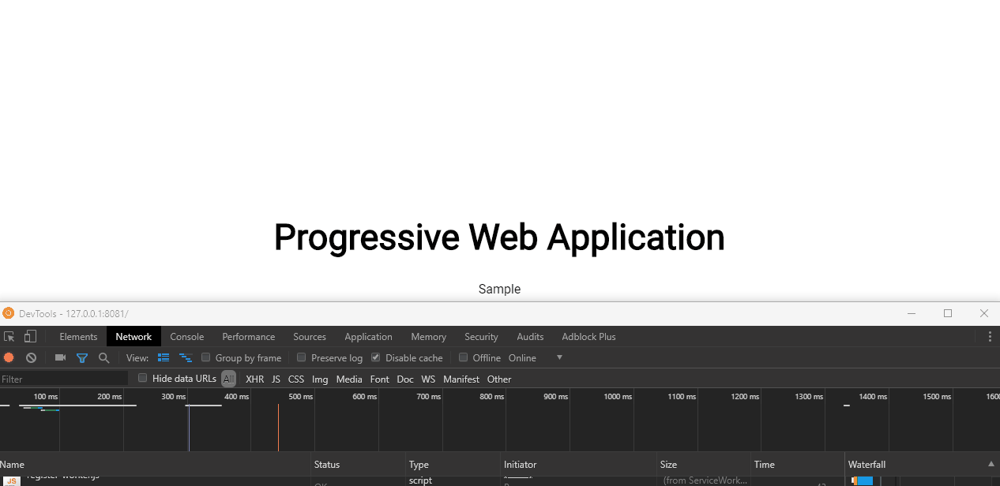

# Example of Progressive Web Application

An example of progressive web application with server worker. 

## Getting Started

### Running the web App ###

- Clone this git hub repo
- Host the folder in a web server (if using node - download http-server i.e. `npm install http-server -g` & in cmd window from the folder run `http-server`)
- Access the website via `localhost:[port from server]` or `127.0.0.0:[port from server]`
- From Chrome developer tool navigate to `Network` and disable `cache` and toggle `offline` flag. Refresh the page after toggling offline/online flag and you will see the text `Progressive Web Application` changing font color based on network status. 

### Demo ###

More about Progressive web Applications:
https://developers.google.com/web/progressive-web-apps/
